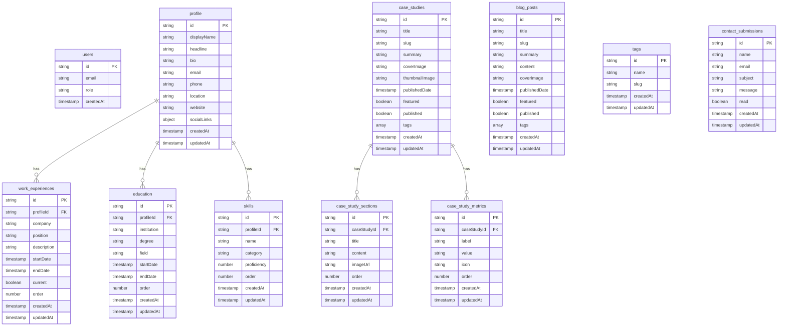

# Firebase Backend Implementation Plan

This plan outlines the implementation of a standalone Firebase backend in a separate repository for your personal website.

## 1. Repository Structure

```
firebase-backend/
├── .github/
│   └── workflows/
│       └── deploy.yml
├── functions/
│   ├── src/
│   │   ├── index.ts
│   │   ├── api/
│   │   │   ├── case-studies.ts
│   │   │   ├── blog-posts.ts
│   │   │   ├── profile.ts
│   │   │   └── contact.ts
│   │   ├── auth/
│   │   │   └── admin.ts
│   │   ├── storage/
│   │   │   └── image-processing.ts
│   │   └── utils/
│   │       ├── validation.ts
│   │       └── error-handler.ts
│   ├── package.json
│   └── tsconfig.json
├── firestore.rules
├── storage.rules
├── firebase.json
├── .firebaserc
├── package.json
└── README.md
```

## 2. Firebase Services Configuration

### Core Services
1. **Firebase Authentication**: For admin login and access control
2. **Cloud Firestore**: For storing structured data (case studies, blog posts, profile)
3. **Firebase Storage**: For storing media files (images, documents)
4. **Cloud Functions**: For server-side logic and API endpoints

### Additional Services
1. **Firebase Hosting** (optional): For hosting API documentation
2. **Firebase Security Rules**: For securing Firestore and Storage access
3. **Firebase Analytics**: For tracking usage patterns

## 3. Firestore Database Schema



## 4. Security Rules Implementation

### Firestore Security Rules

```javascript
rules_version = '2';
service cloud.firestore {
  match /databases/{database}/documents {
    // Helper function to check admin status
    function isAdmin() {
      return request.auth != null && 
        exists(/databases/$(database)/documents/users/$(request.auth.uid)) &&
        get(/databases/$(database)/documents/users/$(request.auth.uid)).data.role == 'admin';
    }
    
    // Public read access for published content
    match /case_studies/{caseStudyId} {
      allow read: if resource.data.published == true;
      allow write: if isAdmin();
    }
    
    match /case_study_sections/{sectionId} {
      allow read: if get(/databases/$(database)/documents/case_studies/$(resource.data.caseStudyId)).data.published == true;
      allow write: if isAdmin();
    }
    
    match /case_study_metrics/{metricId} {
      allow read: if get(/databases/$(database)/documents/case_studies/$(resource.data.caseStudyId)).data.published == true;
      allow write: if isAdmin();
    }
    
    match /blog_posts/{blogPostId} {
      allow read: if resource.data.published == true;
      allow write: if isAdmin();
    }
    
    match /tags/{tagId} {
      allow read: if true;
      allow write: if isAdmin();
    }
    
    match /profile/{profileId} {
      allow read: if true;
      allow write: if isAdmin();
    }
    
    match /work_experiences/{experienceId} {
      allow read: if true;
      allow write: if isAdmin();
    }
    
    match /education/{educationId} {
      allow read: if true;
      allow write: if isAdmin();
    }
    
    match /skills/{skillId} {
      allow read: if true;
      allow write: if isAdmin();
    }
    
    match /contact_submissions/{submissionId} {
      allow create: if true;
      allow read, update, delete: if isAdmin();
    }
    
    match /users/{userId} {
      allow read: if request.auth != null && request.auth.uid == userId;
      allow write: if false; // Only manageable through Firebase Console or Functions
    }
  }
}
```

### Storage Security Rules

```javascript
rules_version = '2';
service firebase.storage {
  match /b/{bucket}/o {
    // Helper function to check admin status
    function isAdmin() {
      return request.auth != null && 
        firestore.exists(/databases/(default)/documents/users/$(request.auth.uid)) &&
        firestore.get(/databases/(default)/documents/users/$(request.auth.uid)).data.role == 'admin';
    }
    
    match /images/{allPaths=**} {
      allow read: if true;
      allow write: if isAdmin();
    }
    
    match /documents/{allPaths=**} {
      allow read: if true;
      allow write: if isAdmin();
    }
    
    // Temporary upload path with more permissive rules for client-side uploads
    match /uploads/{userId}/{fileName} {
      allow read: if request.auth != null && request.auth.uid == userId;
      allow write: if request.auth != null && 
                     request.auth.uid == userId && 
                     request.resource.contentType.matches('image/.*') && 
                     request.resource.size < 10 * 1024 * 1024;
    }
  }
}
```

## 5. Cloud Functions Implementation

### Key Function Categories

1. **Authentication Functions**
   - Admin user management
   - Role-based access control

2. **Content Management Functions**
   - Create, update, delete case studies
   - Create, update, delete blog posts
   - Manage profile information

3. **Media Processing Functions**
   - Image optimization and resizing
   - Thumbnail generation
   - File validation

4. **Contact Form Functions**
   - Form submission processing
   - Email notifications
   - Spam protection

### Example Function Implementations

```typescript
// functions/src/index.ts
import * as functions from 'firebase-functions';
import * as admin from 'firebase-admin';

// Initialize Firebase Admin
admin.initializeApp();

// Import function modules
import * as caseStudies from './api/case-studies';
import * as blogPosts from './api/blog-posts';
import * as profile from './api/profile';
import * as contact from './api/contact';
import * as imageProcessing from './storage/image-processing';

// Export all functions
exports.createCaseStudy = caseStudies.create;
exports.updateCaseStudy = caseStudies.update;
exports.deleteCaseStudy = caseStudies.delete;

exports.createBlogPost = blogPosts.create;
exports.updateBlogPost = blogPosts.update;
exports.deleteBlogPost = blogPosts.delete;

exports.updateProfile = profile.update;

exports.submitContactForm = contact.submit;
exports.markContactAsRead = contact.markAsRead;
exports.deleteContactSubmission = contact.delete;

exports.processImage = imageProcessing.process;
exports.autoProcessUploadedImage = imageProcessing.autoProcess;
```

## 6. Frontend Integration

### Firebase Configuration for Frontend

```typescript
// In your Next.js frontend project
// lib/firebase.ts
import { initializeApp, getApps } from 'firebase/app';
import { getAuth } from 'firebase/auth';
import { getFirestore } from 'firebase/firestore';
import { getStorage } from 'firebase/storage';
import { getFunctions, httpsCallable } from 'firebase/functions';

const firebaseConfig = {
  apiKey: process.env.NEXT_PUBLIC_FIREBASE_API_KEY,
  authDomain: process.env.NEXT_PUBLIC_FIREBASE_AUTH_DOMAIN,
  projectId: process.env.NEXT_PUBLIC_FIREBASE_PROJECT_ID,
  storageBucket: process.env.NEXT_PUBLIC_FIREBASE_STORAGE_BUCKET,
  messagingSenderId: process.env.NEXT_PUBLIC_FIREBASE_MESSAGING_SENDER_ID,
  appId: process.env.NEXT_PUBLIC_FIREBASE_APP_ID,
  measurementId: process.env.NEXT_PUBLIC_FIREBASE_MEASUREMENT_ID
};

// Initialize Firebase
const app = getApps().length === 0 ? initializeApp(firebaseConfig) : getApps()[0];
const auth = getAuth(app);
const db = getFirestore(app);
const storage = getStorage(app);
const functions = getFunctions(app);

export { app, auth, db, storage, functions };
```

### Environment Variables

```
# .env.local in your Next.js project
NEXT_PUBLIC_FIREBASE_API_KEY=your-api-key
NEXT_PUBLIC_FIREBASE_AUTH_DOMAIN=your-project-id.firebaseapp.com
NEXT_PUBLIC_FIREBASE_PROJECT_ID=your-project-id
NEXT_PUBLIC_FIREBASE_STORAGE_BUCKET=your-project-id.appspot.com
NEXT_PUBLIC_FIREBASE_MESSAGING_SENDER_ID=your-messaging-sender-id
NEXT_PUBLIC_FIREBASE_APP_ID=your-app-id
NEXT_PUBLIC_FIREBASE_MEASUREMENT_ID=your-measurement-id
```

## 7. Deployment Strategy

### CI/CD Pipeline with GitHub Actions

```yaml
# .github/workflows/deploy.yml
name: Deploy Firebase Backend

on:
  push:
    branches:
      - main
  pull_request:
    branches:
      - main

jobs:
  deploy:
    runs-on: ubuntu-latest
    steps:
      - uses: actions/checkout@v3
      
      - name: Setup Node.js
        uses: actions/setup-node@v3
        with:
          node-version: '18'
          
      - name: Install Dependencies
        run: npm ci
        
      - name: Lint
        run: npm run lint
        
      - name: Build
        run: npm run build
        
      - name: Deploy to Firebase
        if: github.ref == 'refs/heads/main'
        uses: FirebaseExtended/action-hosting-deploy@v0
        with:
          repoToken: '${{ secrets.GITHUB_TOKEN }}'
          firebaseServiceAccount: '${{ secrets.FIREBASE_SERVICE_ACCOUNT }}'
          channelId: live
```

### Manual Deployment

```bash
# Install Firebase CLI
npm install -g firebase-tools

# Login to Firebase
firebase login

# Initialize Firebase in your project
firebase init

# Deploy to Firebase
firebase deploy
```

## 8. Implementation Timeline


## 9. Cost Considerations

### Firebase Free Tier Limits
- **Firestore**: 1GB storage, 50K reads, 20K writes, 20K deletes per day
- **Storage**: 5GB storage, 1GB downloads per day, 20K uploads per day
- **Functions**: 2M invocations per month, 400K GB-seconds, 200K CPU-seconds
- **Authentication**: 50K authentications per month

### Estimated Costs Beyond Free Tier
- **Firestore**: $0.18/GB/month for storage, $0.06/100K reads, $0.18/100K writes
- **Storage**: $0.026/GB/month for storage, $0.12/GB for downloads
- **Functions**: $0.40/million invocations, $0.00001/GB-second, $0.00001667/GHz-second

## 10. Monitoring and Maintenance

### Monitoring Setup
1. Firebase Console dashboard for real-time monitoring
2. Firebase Alerts for critical issues
3. Google Cloud Monitoring for advanced metrics

### Regular Maintenance Tasks
1. Security rules review and updates
2. Database optimization and cleanup
3. Function performance optimization
4. Dependency updates

## 11. Documentation

### API Documentation
1. OpenAPI/Swagger documentation for Cloud Functions
2. Function usage examples
3. Authentication requirements

### Integration Guide
1. Frontend integration steps
2. Environment setup instructions
3. Common patterns and best practices